# GoCode Info:
  - Video:

# Introduction

Where would you start a business?  Why would you chose that location?  Would it be worth moving or hiring from other regions to increase your chances of success?  In this analysis we will explore factors that should help guide you to choosing the best place to start your business.

# Methodology

# GoCode Colorado - Analysis

We focused on many datasets for this competition.  Our focus was on four data type structures: business, GDP, college degrees, and college finances.    

The first dataset we focused on was 'Degrees Awarded to Post-Secondary Graduates in Colorado'.  

Description of the dataset: 'Demographics for all certificate, degree, or formal award approved by Colorado Department of Higher Education (CDHE) for students since 2001. Demographics include data on age, ethnicity, program name, and residency.'

# Breakdown of Institutions' Awardees

There are 29 unique institutions described in the dataset. For any given year, if the awardees associated with the institution was greater than 5% of total awardees for the year, the institution is represented. For all institutions which make up less than or equal to 5% of total awardees, that institution is grouped into 'Other'.

  |   | 
------------- | -------------  | -------------

From 2001 to 2017 we can see still about half of institution awardees are enrolling in smaller institutions (those individual institutions which make of less than 5% of total awardees for the year).

We see the percent of awardees enrolling in community colleges and other more affordable institutions increasing. Front Range Community College, Colorado Mountain College, and Pikes Peak Community College are all more prevalent in 2017 than they were in 2001.

On the flip-side, larger more expensive institutions have seen the percent of awardees decreasing. This can be seen with Colorado State University, University of Colorado Denver, and University of Colorado Boulder from 2001 to 2017.

#### Percentage of Awardees from Institution Types in 2001 and 2017

Year  | Universities | Community Colleges | State Colleges
------------- | ------------- | ------------- | -------------
2001  | 62%  | 27%  | 11%
2017  | 50%  | 34%  | 16%

Taking a more generalized approach, and looking at Universities, Community Colleges, and State Colleges, it is easier to see the same trends. The percentage of students receiving awards from smaller institutions (community colleges and state colleges) is increasing. Meanwhile, the percentage of students receiving awards from larger universities is decreasing.

## Breakdown of Awarded Degrees

Awardees of the institutions are in various degree programs, which include: Associate, Bachelor, Certificate, Doctoral, Masters, OtherGraduate, Professional, Specialist. We can look at how the breakdown of degrees have changed from 2001 to 2017.

  |   | 
------------- | -------------  | -------------

The percent of awardees enrolling in Bachelor and Masters degree programs have taken a dip from 2001 and 2017, while the percent of those awardees from institutions for Certificate degrees has increased (almost doubled). This seems to support the 'Breakdown of Institutions' analysis - less percentages of people are opting to go with the more expensive education options (large universities and longer degree programs) and more are opting to go with the less expensive options (more affordable universities and shorter degree programs).

#### Percentage of Awardees from Degree Types in 2001 and 2017

Year  | Bachelors | Associate | Masters | Certificate
------------- | ------------- | ------------- | ------------- | -------------
2001  | 46%  | 21%  | 18% | 15%
2017  | 37%  | 19%  | 15% | 29%

The percentage of awards given out to Bachelors students has decreased by almost 10% while awards given out to students gaining Certificates has nearly doubled.

## Breakdown of Awardees Programs

Awardees of the institutions are more specifically in certain programs. The programs vary from sociology to welding to law and everything in between. Over 500 specific programs are detailed. We categorized these programs into nine buckets to make for easier analysis. The buckets are:
* Computer Science
* Art/History
* Social Science
* Math/Engineering
* Physical/Medical/Wellness
* Law
* General Science
* Labor
* Business

  |   | 
------------- | -------------  | -------------

#### Percentage of Awardees from Program Types in 2001 and 2017

Year  | Social Science | Arts/History | Physical/Medical/Wellness | Labor/Trade
------------- | ------------- | ------------- | ------------- | -------------
2001  | 22%  | 23%  | 10% | 3%
2017  | 16%  | 19%  | 18% | 7%

We can see a bit of a shift from traditional programs like Social Sciences, The Arts, and History towards modern programs like computer science, health and wellness, as well as trade programs.

## Breakdown by Metro Areas

To further break down the analysis into more granular segments, we did similar analysis on seven different 'metro' areas we defined. They are:

* Boulder
* Colorado Springs
* Denver
* Fort Collins
* Greeley
* Pueblo
* Western Slope

### Boulder

#### Breakdown by Institution Type

  |   | 
------------- | -------------  | -------------

<!-- Year  | Universities | Community Colleges
------------- | ------------- | -------------
2001  | 77%  | 23%  
2017  | 63%  | 37%   -->

#### Breakdown by Degree

  |   | 
------------- | -------------  | -------------

<!-- Year  | Bachelors | Associate | Masters | Certificate
------------- | ------------- | ------------- | ------------- | -------------
2001  | 46%  | 21%  | 18% | 15%
2017  | 37%  | 19%  | 15% | 29% -->

#### Breakdown by Program

  |   | 
------------- | -------------  | -------------

### Colorado Springs

#### Breakdown by Institution Type

  |   | 
------------- | -------------  | -------------

#### Breakdown by Degree

  |   | 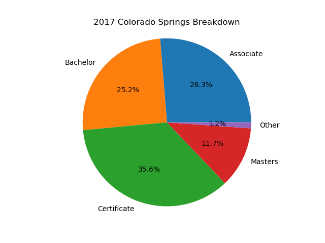
------------- | -------------  | -------------

#### Breakdown by Program

  |   | 
------------- | -------------  | -------------

### Denver

#### Breakdown by Institution Type

  |   | 
------------- | -------------  | -------------

#### Breakdown by Degree

  | 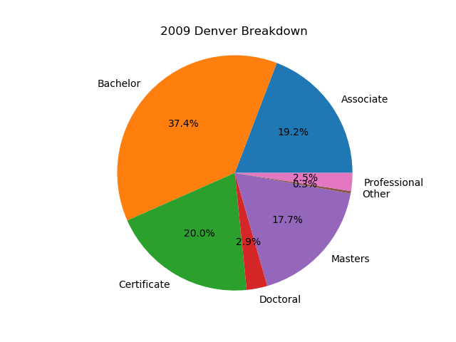  | 
------------- | -------------  | -------------

#### Breakdown by Program

  |   | 
------------- | -------------  | -------------

### Fort Collins

#### Breakdown by Institution Type

  |   | 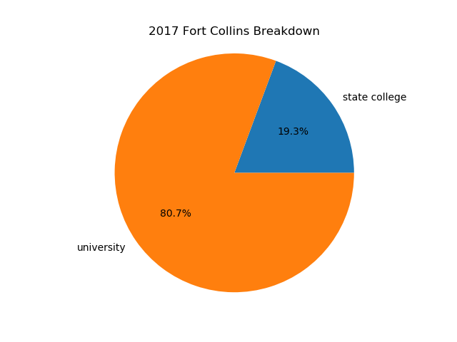
------------- | -------------  | -------------

#### Breakdown by Degree

  |   | 
------------- | -------------  | -------------

#### Breakdown by Program

  |   | 
------------- | -------------  | -------------

### Greeley

#### Breakdown by Institution Type

  |   | 
------------- | -------------  | -------------

#### Breakdown by Degree

  |   | 
------------- | -------------  | -------------

#### Breakdown by Program

  |   | 
------------- | -------------  | -------------

### Pueblo

#### Breakdown by Institution Type

  |   | 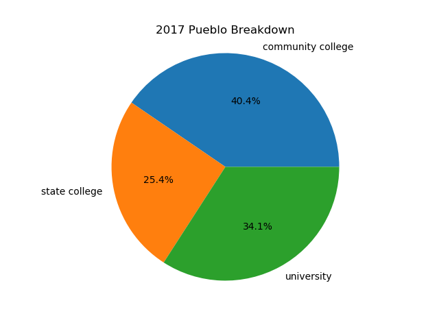
------------- | -------------  | -------------

#### Breakdown by Degree

  |   | 
------------- | -------------  | -------------

#### Breakdown by Program

  |   | 
------------- | -------------  | -------------

### Western Slope

#### Breakdown by Institution Type

  |   | 
------------- | -------------  | -------------

#### Breakdown by Degree

  |   | 
------------- | -------------  | -------------

#### Breakdown by Program

  |   | 
------------- | -------------  | -------------

_______________________________________________________________________________

# RYANNNNNNNNNNNNNNNNNNNNNNNNNNNNNNNNNNNNNNNNNNNNNNN

# Breakdown of Business Entity Data

We then looked at business entity formation data to get an idea of whether start-ups were growing or shrinking in Colorado and the specific metro areas.We wanted to see if area with higher number of start-ups saw an increase in per capita GDP. We used per capita GDP as our target metric because it measures the total output of the economy while accounting for population growth or decline within those area. We used the real per capita GDP so that we had a specific dollar value to tie it to to control for inflation over time. For this section we used data from many sources including but not limited to the Colorado Department of State, U.S. Bureau of Economic Analysis, Federal Reserve Bank of St. Louis, and the Colorado Department of Local Affairs. From these sources we used population data, state GDP data, business entity formation data, and real per capita GDP data for state and metro areas.  

Our main dataset was the Business Entity Dataset from CDOS - Colorado Department of State, a CIM dataset. From here we focused our study on the years 2001-2017 in order to match it up with the Degrees Awarded dataset above.We then found data to match this time period for state population, state GDP (current dollars), and state and metro area real per capita GDP (chained 2012 dollars for state GDP and chained 2009 dollars for metro area GDP) to complete our analysis. We decided to focus on seven (7) metro areas across Colorado, including Denver-Aurora-Lakewood, Boulder, Colorado Springs, Fort Collins, Grand Junction, Greeley, and Pueblo.

#### Cleaning and Preparing the Data

We started by cleaning and preparing the data. Initially, our dataset consisted of 1,848,357 rows (businesses formed) and 35 columns of data. The first record of an entity formation date started at 03/05/1864 and ended at 4/11/2019.

We then checked for null values using some code and then the missingno matrix plot.

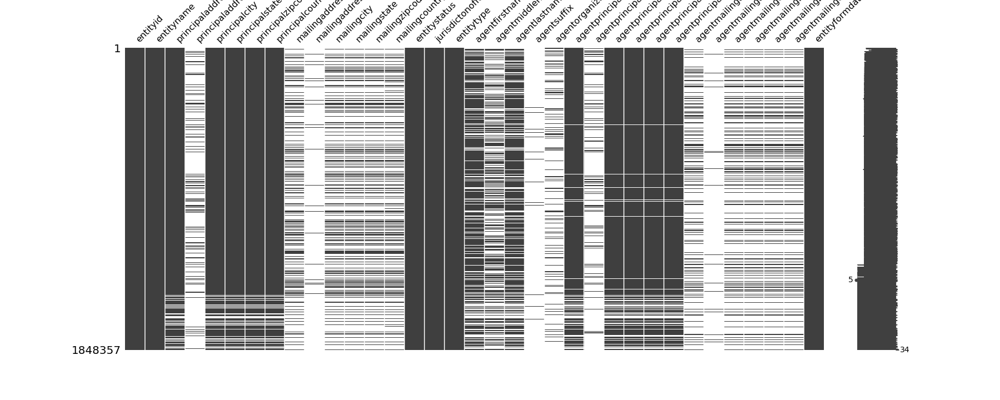

We then dropped all unnecessary columns and rows from the dataset to focus on our intended time period and saved a new clean csv with that data. Then we filtered the data and dropped any unnecessary rows in order to target the metro areas. We did this by creating a dictionary mapping the metro area to all zip codes contained within that metro area. Once we had that data cleaned and prepped, we created a new csv file with that data.

Reference: The cleaning and preparation of the business dataset can be found in the go-code-co_data_clean Jupyter Notebook.  

#### Business Entity Summary Data for Entire Time Period 2001-2017

Total Number of Businesses Formed 2001-2017: 1147849

Status of Businesses Formed:

Entity Status  | Total Businesses | Percent of Total
------------- | ------------- | -------------
Delinquent  | 486725 | 42.40%
Good Standing  | 408635  | 35.60%
Voluntarily Dissolved  | 208854  | 18.20%
Administratively Dissolved  | 27006  | 2.35%
Noncompliant  | 12288  | 1.07%
Withdrawn  | 2159  | 0.19%
Exists  | 2066  | 0.18%
Dissolved (Term Expired)  | 99  | 0.01%
Judicially Dissolved  | 16  | 0.00%
Effectiveness Prevented  | 1  | 0.00%

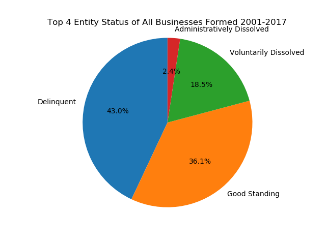

Type of Businesses Formed:

Entity Type  | Total Businesses | Percent of Total
------------- | ------------- | -------------
Limited Liability Company  | 864556 | 75.32%
Corporation  | 211689  | 18.44%
Nonprofit Corporation  | 50853  | 4.43%
Administratively Dissolved  | 27006  | 2.35%
Noncompliant  | 12288  | 1.07%
Withdrawn  | 2159  | 0.19%
Exists  | 2066  | 0.18%
Dissolved (Term Expired)  | 99  | 0.01%
Judicially Dissolved  | 16  | 0.00%
Effectiveness Prevented  | 1  | 0.00%

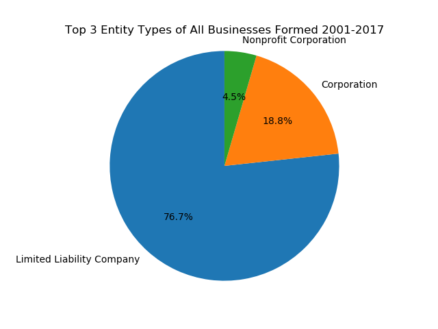

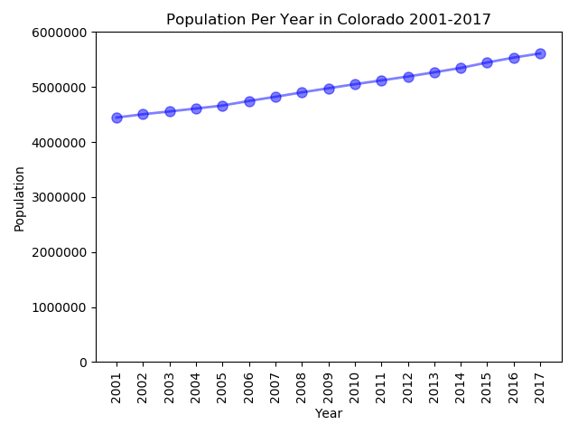

From 2001 to 2017 we can see still about half of institution awardees are enrolling in smaller institutions (those individual institutions which make of less than 5% of total awardees for the year).

We see the percent of awardees enrolling in community colleges and other more affordable institutions increasing. Front Range Community College, Colorado Mountain College, and Pikes Peak Community College are all more prevalent in 2017 than they were in 2001.

On the flip-side, larger more expensive institutions have seen the percent of awardees decreasing. This can be seen with Colorado State University, University of Colorado Denver, and University of Colorado Boulder from 2001 to 2017.

#### Percentage of Awardees from Institution Types in 2001 and 2017

Year  | Universities | Community Colleges | State Colleges
------------- | ------------- | ------------- | -------------
2001  | 62%  | 27%  | 11%
2017  | 50%  | 34%  | 16%

Taking a more generalized approach, and looking at Universities, Community Colleges, and State Colleges, it is easier to see the same trends. The percentage of students receiving awards from smaller institutions (community colleges and state colleges) is increasing. Meanwhile, the percentage of students receiving awards from larger universities is decreasing.

## Breakdown of Awarded Degrees

Awardees of the institutions are in various degree programs, which include: Associate, Bachelor, Certificate, Doctoral, Masters, OtherGraduate, Professional, Specialist. We can look at how the breakdown of degrees have changed from 2001 to 2017.

  |   | 
------------- | -------------  | -------------

The percent of awardees enrolling in Bachelor and Masters degree programs have taken a dip from 2001 and 2017, while the percent of those awardees from institutions for Certificate degrees has increased (almost doubled). This seems to support the 'Breakdown of Institutions' analysis - less percentages of people are opting to go with the more expensive education options (large universities and longer degree programs) and more are opting to go with the less expensive options (more affordable universities and shorter degree programs).

#### Percentage of Awardees from Degree Types in 2001 and 2017

Year  | Bachelors | Associate | Masters | Certificate
------------- | ------------- | ------------- | ------------- | -------------
2001  | 46%  | 21%  | 18% | 15%
2017  | 37%  | 19%  | 15% | 29%

The percentage of awards given out to Bachelors students has decreased by almost 10% while awards given out to students gaining Certificates has nearly doubled.

## Breakdown of Awardees Programs

Awardees of the institutions are more specifically in certain programs. The programs vary from sociology to welding to law and everything in between. Over 500 specific programs are detailed. We categorized these programs into nine buckets to make for easier analysis. The buckets are:
* Computer Science
* Art/History
* Social Science
* Math/Engineering
* Physical/Medical/Wellness
* Law
* General Science
* Labor
* Business

  |   | 
------------- | -------------  | -------------

#### Percentage of Awardees from Program Types in 2001 and 2017

Year  | Social Science | Arts/History | Physical/Medical/Wellness | Labor/Trade
------------- | ------------- | ------------- | ------------- | -------------
2001  | 22%  | 23%  | 10% | 3%
2017  | 16%  | 19%  | 18% | 7%

We can see a bit of a shift from traditional programs like Social Sciences, The Arts, and History towards modern programs like computer science, health and wellness, as well as trade programs.

## Breakdown by Metro Areas

To further break down the analysis into more granular segments, we did similar analysis on seven different 'metro' areas we defined. They are:

* Boulder
* Colorado Springs
* Denver
* Fort Collins
* Greeley
* Pueblo
* Western Slope

### Boulder

#### Breakdown by Institution Type

  |   | 
------------- | -------------  | -------------

<!-- Year  | Universities | Community Colleges
------------- | ------------- | -------------
2001  | 77%  | 23%  
2017  | 63%  | 37%   -->

#### Breakdown by Degree

  |   | 
------------- | -------------  | -------------

<!-- Year  | Bachelors | Associate | Masters | Certificate
------------- | ------------- | ------------- | ------------- | -------------
2001  | 46%  | 21%  | 18% | 15%
2017  | 37%  | 19%  | 15% | 29% -->

#### Breakdown by Program

  |   | 
------------- | -------------  | -------------

### Colorado Springs

#### Breakdown by Institution Type

  |   | 
------------- | -------------  | -------------

#### Breakdown by Degree

  |   | 
------------- | -------------  | -------------

#### Breakdown by Program

  |   | 
------------- | -------------  | -------------

### Denver

#### Breakdown by Institution Type

  |   | 
------------- | -------------  | -------------

#### Breakdown by Degree

  |   | 
------------- | -------------  | -------------

#### Breakdown by Program

  |   | 
------------- | -------------  | -------------

### Fort Collins

#### Breakdown by Institution Type

  |   | 
------------- | -------------  | -------------

#### Breakdown by Degree

  |   | 
------------- | -------------  | -------------

#### Breakdown by Program

  |   | 
------------- | -------------  | -------------

### Greeley

#### Breakdown by Institution Type

  |   | 
------------- | -------------  | -------------

#### Breakdown by Degree

  |   | 
------------- | -------------  | -------------

#### Breakdown by Program

  |   | 
------------- | -------------  | -------------

### Pueblo

#### Breakdown by Institution Type

  |   | 
------------- | -------------  | -------------

#### Breakdown by Degree

  |   | 
------------- | -------------  | -------------

#### Breakdown by Program

  |   | 
------------- | -------------  | -------------

### Western Slope

#### Breakdown by Institution Type

  |   | 
------------- | -------------  | -------------

#### Breakdown by Degree

  |   | 
------------- | -------------  | -------------

#### Breakdown by Program

  |   | 
------------- | -------------  | -------------

_______________________________________________________________________________

# SCOTTTT TTTTTT TTTTTT TTTTT TTT

# Breakdown of Financial Entity Data

There are 29 unique institutions described in the dataset. For any given year, if the awardees associated with the institution was greater than 5% of total awardees for the year, the institution is represented. For all institutions which make up less than or equal to 5% of total awardees, that institution is grouped into 'Other'.

  |   | 
------------- | -------------  | -------------

From 2004 to 2016 we can see still about half of students were using federal loans to pay for college. State aid paid to university stayed consistent percentage wise, hovering around 8-9%.

The data set does not look to include private loans or paying for school out of pocket.  This information could be useful for future analysis into indebtedness of students.

Looking at total federal loans and State aid we can see there is a large increase from 2004 to 2016.

State aid was stagnant after the recession of 2009 while federal loans continued to climb.  State aid doubled from 2004 to 2016 giving students about 160 million is aid.  Federal loans nearly doubled as well indebting students by about 800 million dollars in 2016.

Scholarship levels have shown continual growth from 2004 - 2016.  

what we are seeing is students have incurred more debt but they have also gained more aid from the State and more scholarships are being given out.

## Breakdown by Metro Areas

To further break down the analysis into more granular segments, we did similar analysis on seven different 'metro' areas we defined. They are:

* Boulder
* Colorado Springs
* Denver
* Fort Collins
* Greeley
* Pueblo
* Grand Junction / Western Slope

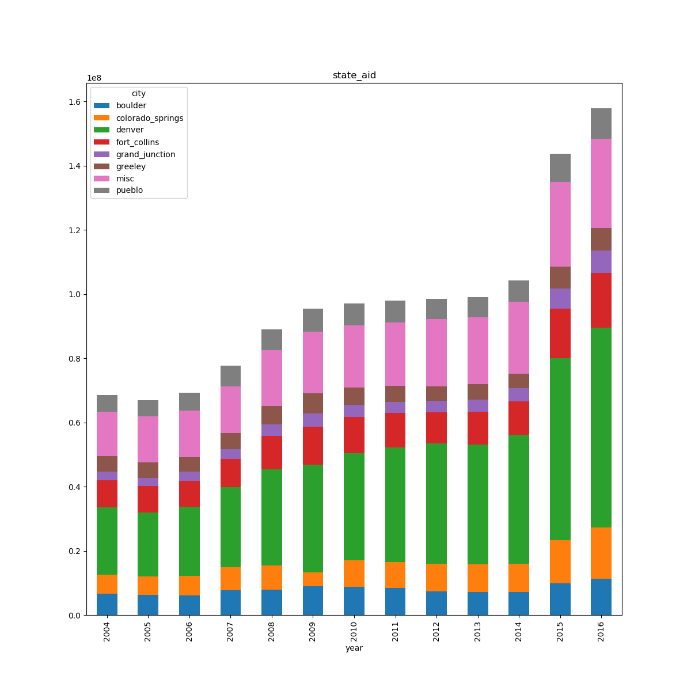 | |
------------- | -------------  | -------------
### Boulder

#### Breakdown by Aid Type

  |   | 
------------- | -------------  | -------------

#### Average Breakdown by Aid Type 2004-2016

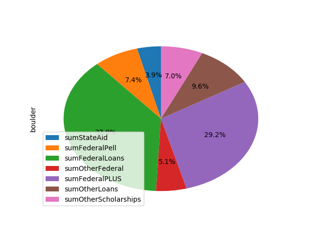

### Colorado Springs

#### Breakdown by Aid Type

  |   | 
------------- | -------------  | -------------

#### Average Breakdown by Aid Type 2004-2016

  

### Denver

#### Breakdown by Aid Type

  |   | 
------------- | -------------  | -------------

#### Average Breakdown by Aid Type 2004-2016

### Fort Collins

#### Breakdown by Aid Type

  |   | 
------------- | -------------  | -------------

#### Breakdown by Aid Type 2004-2016

### Greeley

#### Breakdown by by Aid Type

  |   | 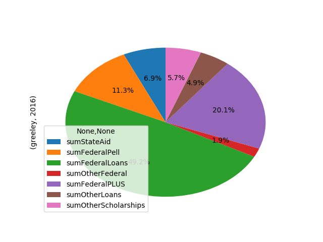
------------- | -------------  | -------------
------------- | -------------  | -------------

#### Breakdown by Aid Type 2004-2016

### Pueblo

#### Breakdown by by Aid Type

  |   | 
------------- | -------------  | -------------

#### Breakdown by Aid Type 2004-2016

### Grand Junction / Western Slope

#### Breakdown by by Aid Type

  |   | 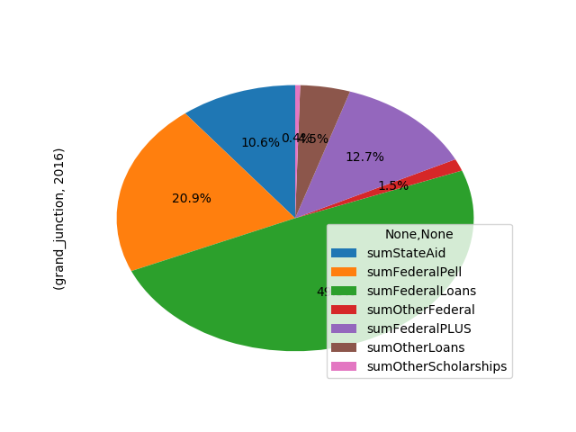
------------- | -------------  | -------------
------------- | -------------  | -------------

#### Breakdown by Aid Type 2004-2016

### Misc and Unassigned Schools

#### Breakdown by by Aid Type

  |   | 
------------- | -------------  | -------------

#### Breakdown by Aid Type 2004-2016

