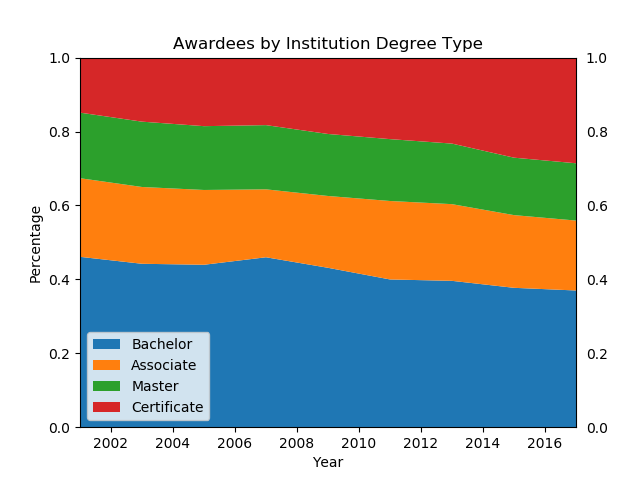
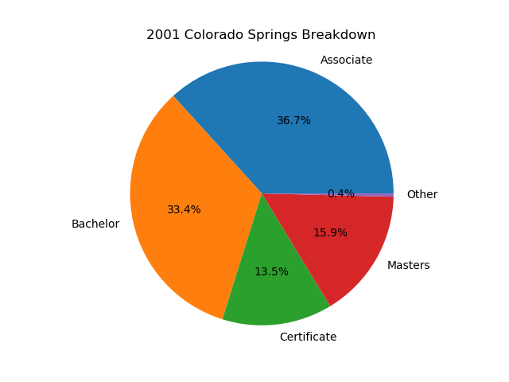

# GoCode Colorado - Analysis

The first dataset we focused on was 'Degrees Awarded to Post-Secondary Graduates in Colorado'.

Description of the dataset: 'Demographics for all certificate, degree, or formal award approved by Colorado Department of Higher Education (CDHE) for students since 2001. Demographics include data on age, ethnicity, program name, and residency.'

## Breakdown of Institutions' Awardees

There are 29 unique institutions described in the dataset. For any given year, if the awardees associated with the institution was greater than 5% of total awardees for the year, the institution is represented. For all institutions which make up less than or equal to 5% of total awardees, that institution is grouped into 'Other'.

  |   | 
------------- | -------------  | -------------

From 2001 to 2017 we can see still about half of institution awardees are enrolling in smaller institutions (those individual institutions which make of less than 5% of total awardees for the year).

We see the percent of awardees enrolling in community colleges and other more affordable institutions increasing. Front Range Community College, Colorado Mountain College, and Pikes Peak Community College are all more prevalent in 2017 than they were in 2001.

On the flip-side, larger more expensive institutions have seen the percent of awardees decreasing. This can be seen with Colorado State University, University of Colorado Denver, and University of Colorado Boulder from 2001 to 2017.

#### Percentage of Awardees from Institution Types in 2001 and 2017

Year  | Universities | Community Colleges | State Colleges
------------- | ------------- | ------------- | -------------
2001  | 62%  | 27%  | 11%
2017  | 50%  | 34%  | 16%

Taking a more generalized approach, and looking at Universities, Community Colleges, and State Colleges, it is easier to see the same trends. The percentage of students receiving awards from smaller institutions (community colleges and state colleges) is increasing. Meanwhile, the percentage of students receiving awards from larger universities is decreasing.

## Breakdown of Awarded Degrees

Awardees of the institutions are in various degree programs, which include: Associate, Bachelor, Certificate, Doctoral, Masters, OtherGraduate, Professional, Specialist. We can look at how the breakdown of degrees have changed from 2001 to 2017.

  |   | 
------------- | -------------  | -------------

The percent of awardees enrolling in Bachelor and Masters degree programs have taken a dip from 2001 and 2017, while the percent of those awardees from institutions for Certificate degrees has increased (almost doubled). This seems to support the 'Breakdown of Institutions' analysis - less percentages of people are opting to go with the more expensive education options (large universities and longer degree programs) and more are opting to go with the less expensive options (more affordable universities and shorter degree programs).

#### Percentage of Awardees from Degree Types in 2001 and 2017

Year  | Bachelors | Associate | Masters | Certificate
------------- | ------------- | ------------- | ------------- | -------------
2001  | 46%  | 21%  | 18% | 15%
2017  | 37%  | 19%  | 15% | 29%

The percentage of awards given out to Bachelors students has decreased by almost 10% while awards given out to students gaining Certificates has nearly doubled.

## Breakdown of Awardees Programs

Awardees of the institutions are more specifically in certain programs. The programs vary from sociology to welding to law and everything in between. Over 500 specific programs are detailed. We categorized these programs into nine buckets to make for easier analysis. The buckets are:
* Computer Science
* Art/History
* Social Science
* Math/Engineering
* Physical/Medical/Wellness
* Law
* General Science
* Labor
* Business

  |   | 
------------- | -------------  | -------------

#### Percentage of Awardees from Program Types in 2001 and 2017

Year  | Social Science | Arts/History | Physical/Medical/Wellness | Labor/Trade
------------- | ------------- | ------------- | ------------- | -------------
2001  | 22%  | 23%  | 10% | 3%
2017  | 16%  | 19%  | 18% | 7%

We can see a bit of a shift from traditional programs like Social Sciences, The Arts, and History towards modern programs like computer science, health and wellness, as well as trade programs.

## Breakdown by Metro Areas

To further break down the analysis into more granular segments, we did similar analysis on seven different 'metro' areas we defined. They are:

* Boulder
* Colorado Springs
* Denver
* Fort Collins
* Greeley
* Pueblo
* Western Slope

### Boulder

#### Breakdown by Institution

  |   | 
------------- | -------------  | -------------

#### Breakdown by Degree

  |   | 
------------- | -------------  | -------------

#### Breakdown by Program

  |   | 
------------- | -------------  | -------------

### Colorado Springs

#### Breakdown by Institution

  |   | 
------------- | -------------  | -------------

#### Breakdown by Degree

  |   | 
------------- | -------------  | -------------

#### Breakdown by Program

  |   | 
------------- | -------------  | -------------

### Denver

#### Breakdown by Institution

  |   | 
------------- | -------------  | -------------

#### Breakdown by Degree

  |   | 
------------- | -------------  | -------------

#### Breakdown by Program

  |   | 
------------- | -------------  | -------------

### Fort Collins

#### Breakdown by Institution

  |   | 
------------- | -------------  | -------------

#### Breakdown by Degree

  |   | 
------------- | -------------  | -------------

#### Breakdown by Program

  |   | 
------------- | -------------  | -------------

### Greeley

#### Breakdown by Institution

  |   | 
------------- | -------------  | -------------

#### Breakdown by Degree

  |   | 
------------- | -------------  | -------------

#### Breakdown by Program

  |   | 
------------- | -------------  | -------------

### Pueblo

#### Breakdown by Institution

  |   | 
------------- | -------------  | -------------

#### Breakdown by Degree

  |   | 
------------- | -------------  | -------------

#### Breakdown by Program

  |   | 
------------- | -------------  | -------------

### Western Slope

#### Breakdown by Institution

  |   | 
------------- | -------------  | -------------

#### Breakdown by Degree

  |   | 
------------- | -------------  | -------------

#### Breakdown by Program

  |   | 
------------- | -------------  | -------------
