# Breakdown of Business Entity Data

We then looked at business entity formation data to get an idea of whether start-ups were growing or shrinking in Colorado and the specific metro areas. We wanted to see if areas with higher number of start-ups saw an increase in per capita GDP. We used per capita GDP as our target metric because it measures the total output of the economy while accounting for population growth or decline within those areas. We used the real per capita GDP so that we had a specific dollar value to tie it to to control for inflation over time. For this section we used data from many sources including but not limited to the Colorado Department of State, U.S. Bureau of Economic Analysis, Federal Reserve Bank of St. Louis, and the Colorado Department of Local Affairs. From these sources we used population data, state GDP data, business entity formation data, and real per capita GDP data for state and metro areas.  

Our main dataset was the Business Entity Dataset from CDOS - Colorado Department of State, a CIM dataset. From here we focused our study on the years 2001-2017 in order to match it with the Degrees Awarded dataset above. We then found data to match this time period for state population, state GDP (current dollars), and state and metro area real per capita GDP (chained 2012 dollars for state GDP and chained 2009 dollars for metro area GDP) to complete our analysis. We decided to focus on seven (7) metro areas across Colorado, including Denver-Aurora-Lakewood, Boulder, Colorado Springs, Fort Collins, Grand Junction, Greeley, and Pueblo.

#### Cleaning and Preparing the Data

We started by cleaning and preparing the data. Initially, our dataset consisted of 1,848,357 rows (businesses formed) and 35 columns of data. The first record of an entity formation date started at 03/05/1864 and ended at 4/11/2019.

We then checked for null values using some code and then the missingno matrix plot.

We then dropped all unnecessary columns and rows from the dataset to focus on our intended time period and saved a new clean csv with that data. Then we filtered the data and dropped any unnecessary rows in order to target the metro areas. We did this by creating a dictionary mapping the metro area to all zip codes contained within that metro area. Once we had that data cleaned and prepped, we created a new csv file with that data.

Reference: The cleaning and preparation of the business dataset can be found in the go-code-co_data_clean Jupyter Notebook.  

#### State Business Entity, Population, and Gross Domestic Product (GDP) Summary Data for Entire Time Period 2001-2017

Total Number of Businesses Formed 2001-2017: 1,147,849

Status of Businesses Formed:

Entity Status  | Total Businesses | Percent of Total
------------- | ------------- | -------------
Delinquent  | 486725 | 42.40%
Good Standing  | 408635  | 35.60%
Voluntarily Dissolved  | 208854  | 18.20%
Administratively Dissolved  | 27006  | 2.35%
Noncompliant  | 12288  | 1.07%
Withdrawn  | 2159  | 0.19%
Exists  | 2066  | 0.18%
Dissolved (Term Expired)  | 99  | 0.01%
Judicially Dissolved  | 16  | 0.00%
Effectiveness Prevented  | 1  | 0.00%

Type of Businesses Formed:

Entity Type  | Total Businesses | Percent of Total
------------- | ------------- | -------------
Limited Liability Company  | 864556 | 75.32%
Corporation  | 211689  | 18.44%
Nonprofit Corporation  | 50853  | 4.43%
Limited Liability Partnership  | 6931  | 0.60%
Limited Liability Limited Partnership  | 6062  | 0.53%
Limited Partnership  | 4293  | 0.37%
General Partnership  | 2146  | 0.19%
Limited Partnership Association  | 374  | 0.03%
Cooperative  | 316  | 0.03%
Unincorporated Nonprofit Association  | 267 | 0.02%
Corporation Sole | 173 | 0.02%
Limited Cooperative Association | 100 | 0.01%
Cooperative Association | 79 | 0.01%
Foreign Limited Liability Company | 4 | 0.00%
Ditch Company | 4 | 0.00%
Foreign Other | 1 | 0.00%
Foreign Corporation | 1 | 0.00%

Number of Businesses Formed Per Year:

 | 
----- | -----

State Population Trends:

 | 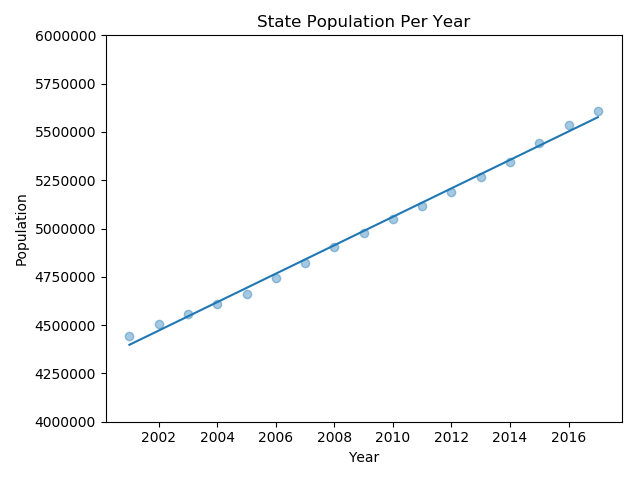
----- | -----
(Left) State Population, (Right) State Population Trend with Linear Regression Line Zoomed-in

State Gross Domestic Product (GDP) Trends:

 | 
----- | -----
(Left) State GDP (current dollars), (Right) State Real Per Capita GDP Trend (chained 2012 dollars)

#### Breakdown of Metro Areas 2001-2017

After looking at state-wide data, we decided to break out seven (7) metro areas and compare them to each other using the state data as a benchmark. We looked at entity status, entity type and real per capita GDP chained to 2009 dollars. Unfortunately, we were not able to find reliable population data that matched our areas as well as timeline so we were not able to compare the number of businesses per 1000 residents to the state's analysis.

Metro Areas:
* Boulder
* Colorado Springs
* Denver (Denver-Aurora-Lakewood)
* Grand Junction
* Greeley
* Fort Collins
* Pueblo

###### Boulder Metro Area

Total Number of Businesses Formed in Boulder:  87,542

Status of Businesses Formed:

Entity Status  | Total Businesses
------------- | -------------
Good Standing  | 33,499  
Delinquent | 33,278
Voluntarily Dissolved  | 17,476  
Administratively Dissolved  | 2,196

Type of Businesses Formed:

Entity Type  | Total Businesses
------------- | -------------
Limited Liability Company  | 68,603
Corporation  | 13,957  
Nonprofit Corporation  | 3,672

Number of Businesses Formed Per Year:

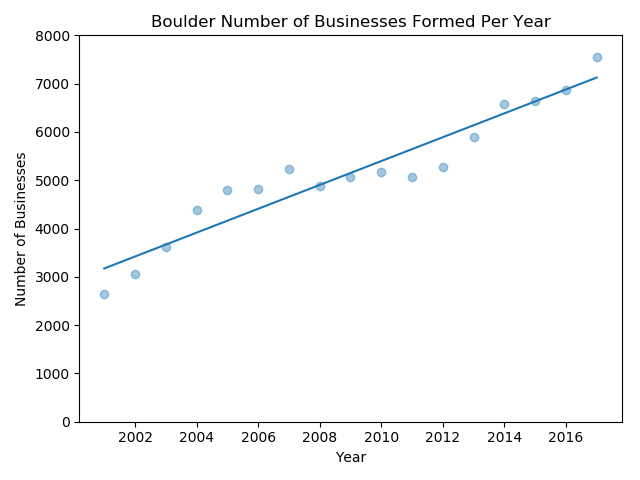

Real Per Capita GDP (chained 2009 dollars) Trends:

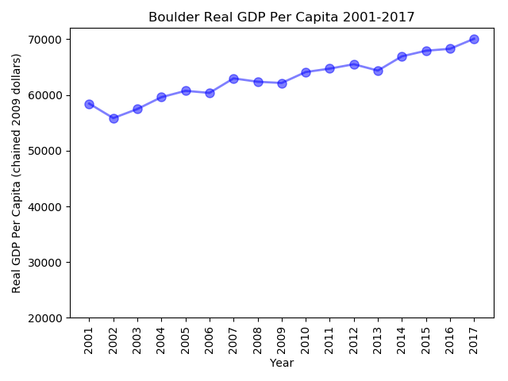 | 
----- | -----
(Left) Real Per Capita GDP, (Right) Real Per Capita GDP Zoomed-in

###### Colorado Springs Metro Area

Total Number of Businesses Formed in Colorado Springs:  110,486

Status of Businesses Formed:

Entity Status  | Total Businesses
------------- | -------------
Delinquent | 48,004
Good Standing  | 38,082  
Voluntarily Dissolved  | 20,426  
Administratively Dissolved  | 2,261

Type of Businesses Formed:

Entity Type  | Total Businesses
------------- | -------------
Limited Liability Company  | 79,255
Corporation  | 23,811
Nonprofit Corporation  | 5,169

Number of Businesses Formed Per Year:

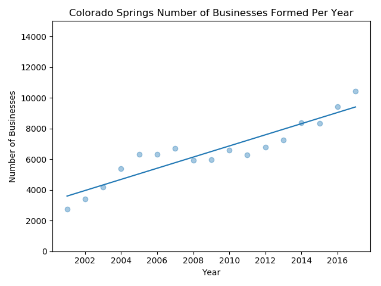

Real Per Capita GDP (chained 2009 dollars) Trends:

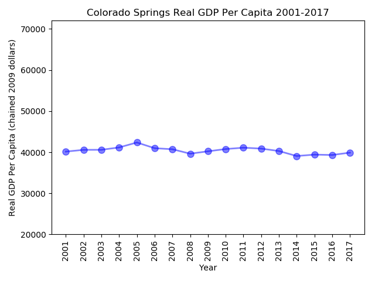 | 
----- | -----
(Left) Real Per Capita GDP, (Right) Real Per Capita GDP Zoomed-in

###### Denver (Denver-Aurora-Lakewood) Metro Area

Total Number of Businesses Formed in Denver: 615,787

Status of Businesses Formed:

Entity Status  | Total Businesses
------------- | -------------
Delinquent | 274,455
Good Standing | 205,182
Voluntarily Dissolved | 111,268
Administratively Dissolved | 15,979

Type of Businesses Formed:

Entity Type  | Total Businesses
------------- | -------------
Limited Liability Company  | 465,610
Corporation  | 116,056
Nonprofit Corporation  | 23,564

Number of Businesses Formed Per Year:

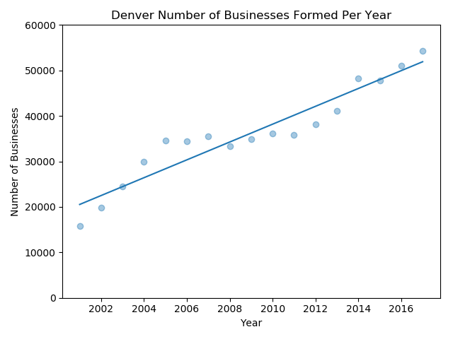

Real Per Capita GDP (chained 2009 dollars) Trends:

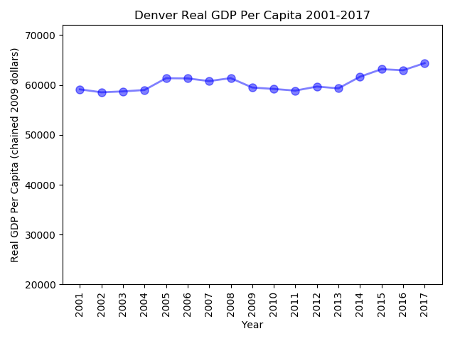 | 
----- | -----
(Left) Real Per Capita GDP, (Right) Real Per Capita GDP Zoomed-in

###### Grand Junction Metro Area

Total Number of Businesses Formed in Grand Junction: 25,141

Status of Businesses Formed:

Entity Status  | Total Businesses
------------- | -------------
Delinquent | 10,878
Good Standing | 9,222
Voluntarily Dissolved | 4,269
Administratively Dissolved | 418

Type of Businesses Formed:

Entity Type  | Total Businesses
------------- | -------------
Limited Liability Company  | 19,052
Corporation  | 4,105
Nonprofit Corporation  | 1,457

Number of Businesses Formed Per Year:

Real Per Capita GDP (chained 2009 dollars) Trends:

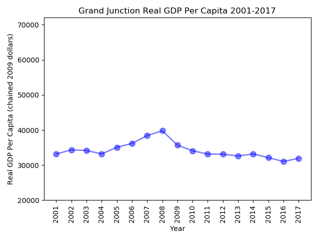 | 
----- | -----
(Left) Real Per Capita GDP, (Right) Real Per Capita GDP Zoomed-in

###### Greeley Metro Area

Total Number of Businesses Formed in Greeley: 44,006

Status of Businesses Formed:

Entity Status  | Total Businesses
------------- | -------------
Delinquent | 18,118
Good Standing | 16,975
Voluntarily Dissolved | 7,372
Administratively Dissolved | 847

Type of Businesses Formed:

Entity Type  | Total Businesses
------------- | -------------
Limited Liability Company  | 34,374
Corporation  | 6,943
Nonprofit Corporation  | 1,871

Number of Businesses Formed Per Year:

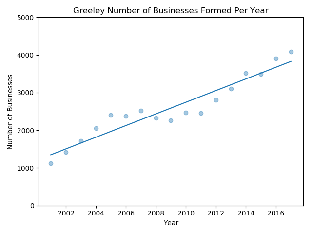

Real Per Capita GDP (chained 2009 dollars) Trends:

 | 
----- | -----
(Left) Real Per Capita GDP, (Right) Real Per Capita GDP Zoomed-in

###### Fort Collins Metro Area

Total Number of Businesses Formed in Fort Collins: 64,084

Status of Businesses Formed:

Entity Status  | Total Businesses
------------- | -------------
Good Standing | 25,624
Delinquent | 24,670
Voluntarily Dissolved | 11,593
Administratively Dissolved | 1,274

Type of Businesses Formed:

Entity Type  | Total Businesses
------------- | -------------
Limited Liability Company  | 50,325
Corporation  | 9,709
Nonprofit Corporation  | 2,944

Number of Businesses Formed Per Year:

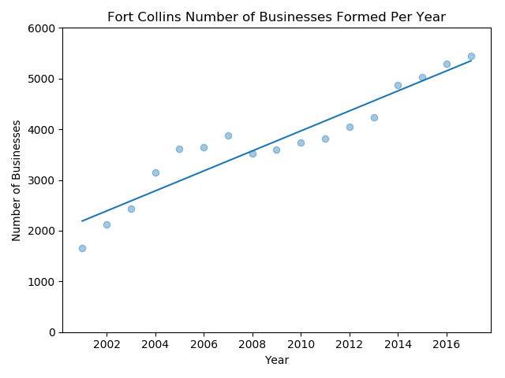

Real Per Capita GDP (chained 2009 dollars) Trends:

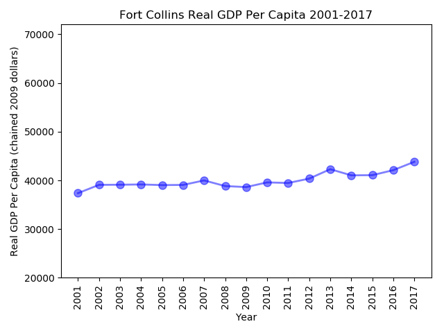 | 
----- | -----
(Left) Real Per Capita GDP, (Right) Real Per Capita GDP Zoomed-in

###### Pueblo Metro Area

Total Number of Businesses Formed in Pueblo: 14,930

Status of Businesses Formed:

Entity Status  | Total Businesses
------------- | -------------
Delinquent | 6,617
Good Standing | 5,212
Voluntarily Dissolved | 2,533
Administratively Dissolved | 325

Type of Businesses Formed:

Entity Type  | Total Businesses
------------- | -------------
Limited Liability Company  | 10,872
Corporation | 2,896
Nonprofit Corporation | 842

Number of Businesses Formed Per Year:

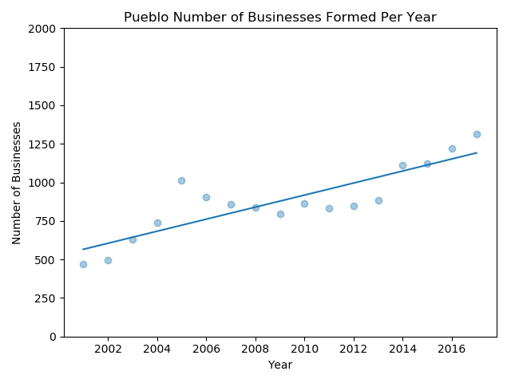

Real Per Capita GDP (chained 2009 dollars) Trends:

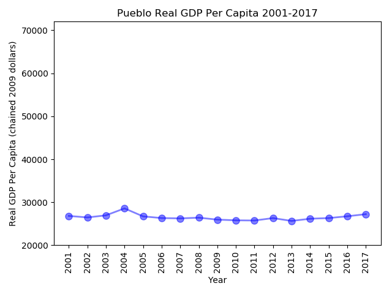 | 
----- | -----
(Left) Real Per Capita GDP, (Right) Real Per Capita GDP Zoomed-in
